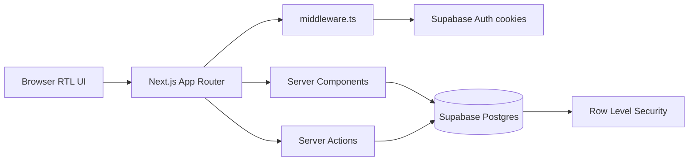

# فاکتورچی (Factorchi)

A **Next.js** web app for freelancers and contractors to manage **projects**, **timesheets**, and **invoices** in Persian (RTL). Track hourly or fixed-price work, generate invoices from logged time, preview printable invoices, and store bank/crypto payment details—all backed by **Supabase** (Auth + Postgres + RLS).

Built as a modern rewrite of the legacy `factorchi` product with the same business behavior: Jalali calendar, Toman/Rial and foreign-currency display, and invoice workflows tuned for Iranian freelancers.

---

## Features

| Feature | Description |
|--------|-------------|
| **Auth** | Email/password sign-up and login via Supabase Auth; session refresh in middleware |
| **Dashboard** | Global stats: active projects, monthly hours (Jalali month), paid/pending totals, insights |
| **Projects** | Hourly or fixed-total contracts; per-project currency; client metadata |
| **Timesheet** | Log work by Jalali month; rates snapshotted at entry time; monthly aggregates |
| **Invoices** | Draft → sent → paid/overdue/canceled; line items from hours or % of project total |
| **Invoice builder** | Tax, alternate currency (divide/multiply exchange), payment method on invoice |
| **Preview & print** | Live invoice preview with `print:` styles for browser PDF/print |
| **Payment methods** | Reusable bank or crypto profiles; default method; attach to invoices |
| **Profile** | Full name, default currency |
| **Theme** | Light/dark toggle (system-aware) |
| **Security** | Row Level Security on all tables; users only see their own data |

### Supported project & billing modes

| Mode | Use case |
|------|----------|
| **Hourly (`hourly`)** | Timesheet tab enabled; invoices generated from grouped time entries by rate |
| **Fixed total (`total`)** | No timesheet; invoices use a percentage of the project total amount |

### Supported currencies (examples)

- **تومان / ریال** — `toman`, `rial`
- **Foreign** — `usd`, `eur`, `try` (with optional alternate-currency line on invoice)

---

## Quick start

### Requirements

- [Node.js](https://nodejs.org/) 18+
- [pnpm](https://pnpm.io/) 9+ (recommended; repo includes `pnpm-lock.yaml`)
- A [Supabase](https://supabase.com/) project **or** [Supabase CLI](https://supabase.com/docs/guides/cli) for local development

### Install

```bash
git clone <your-repo-url>
cd factorchi
pnpm install
```

### Environment

Copy the example env file and fill in your Supabase keys (Dashboard → Project Settings → API):

```bash
cp .env.example .env.local
```

| Variable | Description |
|----------|-------------|
| `NEXT_PUBLIC_SUPABASE_URL` | Supabase project URL |
| `NEXT_PUBLIC_SUPABASE_ANON_KEY` | Public anon key (browser + server) |
| `SUPABASE_SERVICE_ROLE_KEY` | Service role key (server-only admin tasks; never expose to client) |

### Database

Apply migrations to your linked Supabase project:

```bash
pnpm run db:push
```

Migrations live in `supabase/migrations/` (profiles, projects, time entries, invoices, line items, visibility flags).

To reset a **local** Supabase stack (destructive):

```bash
pnpm run db:reset
```

Local Supabase defaults (see `supabase/config.toml`): API `54321`, DB `54322`, Studio `54323`, app `http://localhost:3000`.

### Run the app

```bash
pnpm run dev
```

Open [http://localhost:3000](http://localhost:3000). Unauthenticated users are redirected to `/login`; signed-in users go to `/dashboard`.

### Production build

```bash
pnpm run build
pnpm run start
```

---

## How to use

1. **Register** at `/register` (or **login** at `/login`).
2. Open **پروفایل** and set your name and default currency.
3. Add **روش‌های پرداخت** (bank or crypto) if you want them on invoices.
4. Create a **پروژه جدید** — choose **ساعتی** or **مبلغ کل**.
5. For hourly projects: open **تایم‌شیت**, pick a Jalali month, and log hours.
6. Open **فاکتورها** → create an invoice (from timesheet range or fixed %).
7. Edit line items, tax, alternate currency, and payment details; use **پیش‌نمایش** before saving.
8. Change invoice **status** (draft → sent → paid, etc.) from the invoice list/editor.
9. Use browser **Print** on the preview page for a PDF copy.

### Example: hourly invoice from timesheet

| Step | Action |
|------|--------|
| Project type | ساعتی (hourly) |
| Timesheet | Log 8h @ 500,000 Toman on several days in the current Jalali month |
| New invoice | Select period covering those entries |
| Result | Line items grouped by rate; subtotal + optional tax; total in project currency |

### Example: fixed project — partial invoice

| Field | Value |
|-------|--------|
| Project type | مبلغ کل (total) |
| Total amount | e.g. `50,000,000` Toman |
| Invoice % | `30` |
| Result | One fixed line: 30% of project total |

---

## Scripts

| Command | Description |
|---------|-------------|
| `pnpm install` | Install dependencies |
| `pnpm run dev` | Next.js dev server (hot reload) |
| `pnpm run build` | Production build |
| `pnpm run start` | Serve production build |
| `pnpm run lint` | ESLint |
| `pnpm run tsc` | TypeScript check (`tsc --noEmit`) |
| `pnpm run db:push` | Push `supabase/migrations` to linked project |
| `pnpm run db:reset` | Reset local DB and re-apply migrations |

---

## Tech stack

- **Next.js 16** (App Router) — Server Components, Server Actions, middleware
- **React 19** + **TypeScript** — UI and strict typing
- **React Compiler** — enabled in `next.config.ts`
- **Tailwind CSS 4** — styling and print layouts
- **Supabase** — Auth, Postgres, RLS (`@supabase/ssr`, `@supabase/supabase-js`)
- **React Hook Form** + **Zod** — forms and validation
- **date-fns-jalali** — Jalali calendar for timesheet months and labels
- **Sonner** — toast notifications
- **Lucide React** — icons

---

## Project structure

```
factorchi/
├── public/                          # Static assets
├── src/
│   ├── app/
│   │   ├── (auth)/                  # login, register (public)
│   │   ├── (app)/                   # dashboard, projects, profile (authenticated)
│   │   │   ├── dashboard/
│   │   │   ├── projects/            # list, new, [id]/* (timesheet, invoices, settings)
│   │   │   └── profile/
│   │   ├── layout.tsx               # Root layout, theme, toaster
│   │   └── page.tsx                 # Redirect: user → dashboard, else → login
│   ├── components/
│   │   ├── atoms/                   # Button, Input, Card, JalaliDatePicker, …
│   │   └── layout/                  # AppNav, ThemeToggle, ThemeProvider
│   ├── config/
│   │   └── routes.ts                # Central route map (use ROUTES.* everywhere)
│   ├── features/
│   │   ├── auth/                    # Login/register forms + server actions
│   │   ├── dashboard/               # Global stats helpers
│   │   ├── invoice/                 # Builder, preview, generator, actions, schemas
│   │   ├── profile/                 # Profile + payment methods
│   │   ├── projects/                # CRUD, cards, tabs, dashboard stats
│   │   └── timesheet/               # Entries, month picker, aggregates
│   ├── lib/
│   │   ├── auth/                    # requireUser, getOptionalUser
│   │   ├── duration/                # Persian duration formatting
│   │   ├── jalali/                  # Month ranges, labels
│   │   ├── money/                   # Money formatting
│   │   └── supabase/                # client, server, admin, middleware, types
│   └── middleware.ts                # Session refresh on every matched request
├── supabase/
│   ├── config.toml                  # Local Supabase settings
│   └── migrations/                  # SQL schema + RLS policies
├── .env.example
├── next.config.ts
├── package.json
└── tsconfig.json                    # `@/*` → `./src/*`
```

---

## Architecture (high level)



**Request flow**

1. `middleware.ts` calls `updateSession()` to refresh the Supabase session from cookies.
2. `(app)/layout.tsx` runs `requireUser()` — unauthenticated users cannot access app routes.
3. Pages fetch via `createClient()` (server); mutations use Server Actions in `features/*/actions/`.
4. Postgres policies enforce `auth.uid() = user_id` (or equivalent join) on every table.

**Route groups**

| Group | Path prefix | Guard |
|-------|-------------|--------|
| `(auth)` | `/login`, `/register` | Public |
| `(app)` | `/dashboard`, `/projects`, `/profile`, … | `requireUser()` in layout |

---

## Extending the app

### Add a route

Define it once in `src/config/routes.ts`, then reference `ROUTES.myRoute` in links and redirects—do not hardcode path strings in components.

```ts
export const ROUTES = {
  // ...
  myFeature: '/my-feature',
} as const;
```

### Add a currency

Extend `CurrencyCode` and `CURRENCIES` in `src/features/invoice/constants/currencies.ts` and ensure DB/project `currency` values stay consistent.

### Add invoice status behavior

Update `INVOICE_STATUS_LABELS` and `INVOICE_STATUS_TRANSITIONS` in `src/features/invoice/constants/invoice-status.ts`, and align the `invoices.status` check constraint in a new migration.

### New DB tables or columns

1. Add a SQL file under `supabase/migrations/`.
2. Run `pnpm run db:push`.
3. Regenerate or hand-update `src/lib/supabase/database.types.ts`.

---

## Environment & security

| Concern | Approach |
|---------|----------|
| **Auth** | Supabase email/password; HTTP-only session cookies via `@supabase/ssr` |
| **Data isolation** | RLS on `profiles`, `payment_methods`, `projects`, `time_entries`, `invoices`, `invoice_line_items` |
| **Secrets** | Only `NEXT_PUBLIC_*` keys in the browser; `SUPABASE_SERVICE_ROLE_KEY` server-only |
| **Admin client** | `src/lib/supabase/admin.ts` — use only in trusted server code |

Never commit `.env.local` or real API keys.

---

## Known limitations

- UI copy and date UX are **Persian-first**; English localization is not implemented.
- Invoice output is **browser print/PDF**, not server-generated PDF or email delivery.
- Email confirmation is disabled in local Supabase config (`enable_confirmations = false`); production should match your auth policy.
- No multi-tenant org/team model—one user owns all projects and invoices.
- Archived projects and edge-case invoice math should be validated against your legacy `factorchi` expectations before production cutover.

---

## Troubleshooting

| Problem | Try |
|---------|-----|
| Redirect loop or always `/login` | Check `.env.local` URL/anon key; clear cookies; confirm Supabase Auth site URL matches `http://localhost:3000` |
| `db:push` fails | Run `supabase link` to your project; verify CLI login and migration order |
| Empty dashboard after login | Confirm RLS policies applied; check browser network tab for 401/403 from Supabase |
| Timesheet month wrong | URL uses Jalali `year`/`month` search params; use the month picker to reset |
| Invoice totals off | Re-check tax %, alternate currency rate/method (`divide` vs `multiply`), and line item types |
| Type errors after schema change | Update `database.types.ts` and run `pnpm run tsc` |

---

## License

Private application (`"private": true` in `package.json`). No license granted for redistribution unless the repository owner adds one explicitly.

---

## Disclaimer & attribution

> **This project was implemented with [Cursor](https://cursor.com) AI agents** — primarily **Composer** and **Opus** — based on user prompts and iterative feedback, as a structured rewrite of the legacy Factorchi product.
>
> The repository owner **does not claim sole original authorship of every line** and **is not responsible** for:
>
> - Bugs, security issues, or incorrect invoice/tax calculations  
> - Data loss, billing disputes, or compliance with tax or invoicing regulations  
> - Supabase misconfiguration, leaked keys, or weak RLS policies in custom deployments  
> - Any financial or legal decisions made from generated invoices  
>
> Software is provided **“AS IS”**, without warranty of any kind. Review migrations, env vars, and RLS before deploying to production.

---

## Author note

Maintained as the Next.js + Supabase rewrite of Factorchi. Contributions welcome (especially parity fixes against legacy behavior, Jalali edge cases, and payment-method templates). For issues, open a GitHub issue with steps to reproduce, expected vs actual totals, and screenshots of the invoice preview when relevant.
